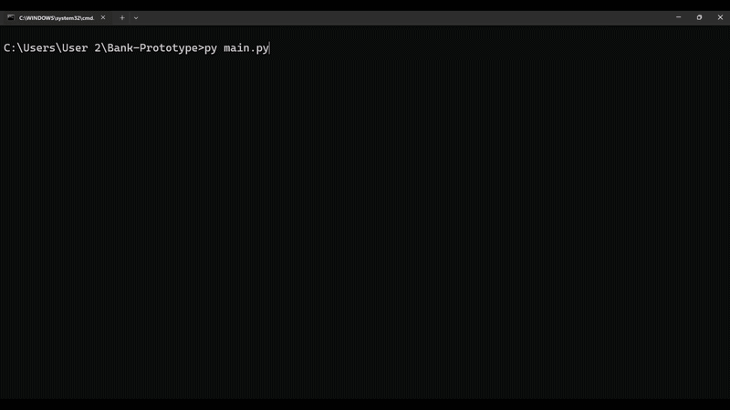
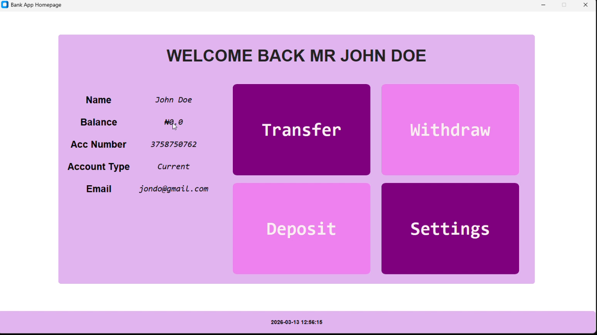
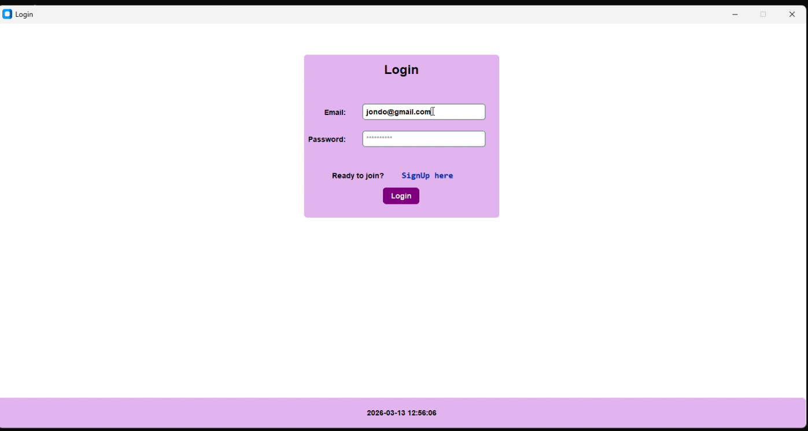
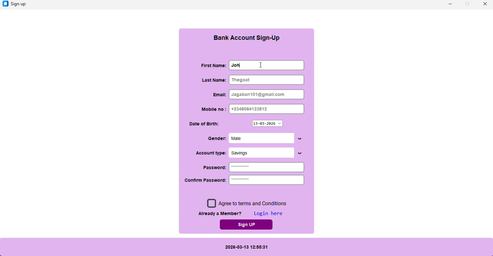
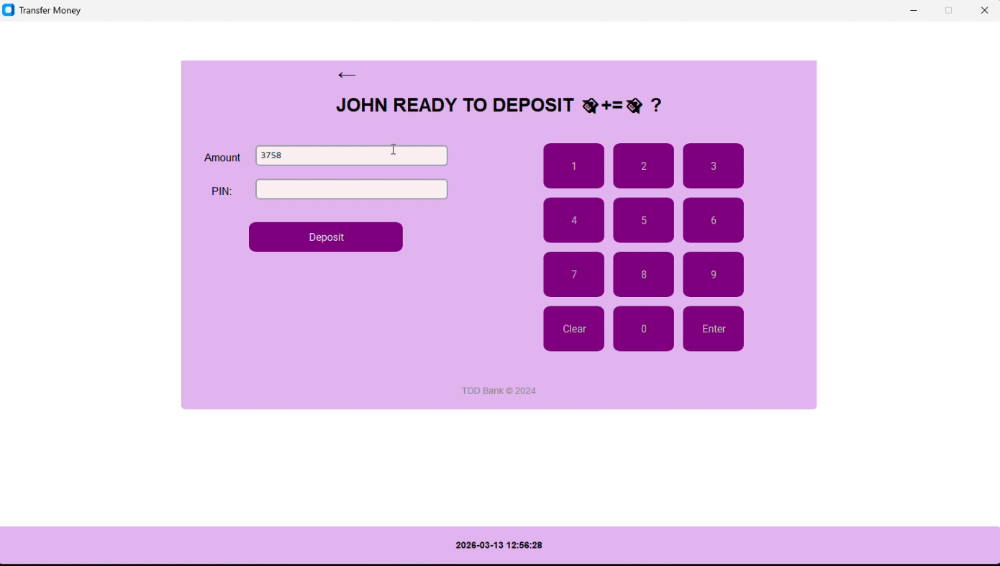
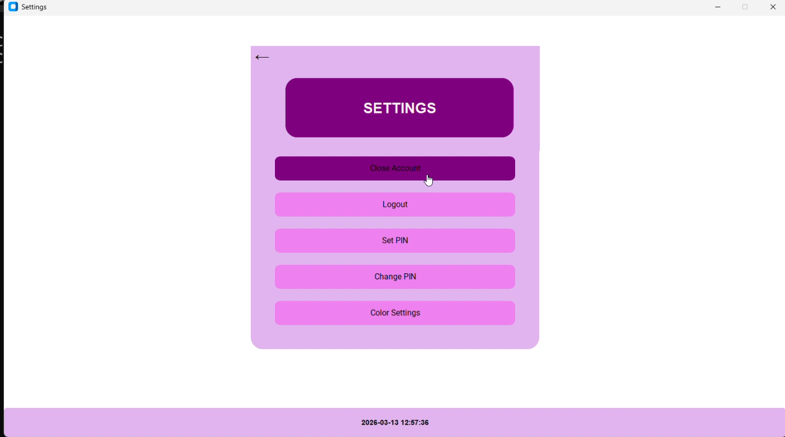

# Bank Prototype

**Bank Prototype** is a beginner-friendly Python desktop app built using **Tkinter**.  
It simulates basic banking operations and demonstrates Python GUI skills.

---

## Features
- Create and manage accounts
- Deposit and withdraw funds
- Transfer money between accounts
- Simple graphical user interface (GUI) with Tkinter

---

## Tech Stack
- Python 3.x
- Tkinter (GUI library)

---
## Preview
  


## Screenshots

  
  
  
  
  

---

## How to Run
1. Clone the repository:
   ```bash
   git clone https://github.com/Keomadia/Bank-Prototype.git
